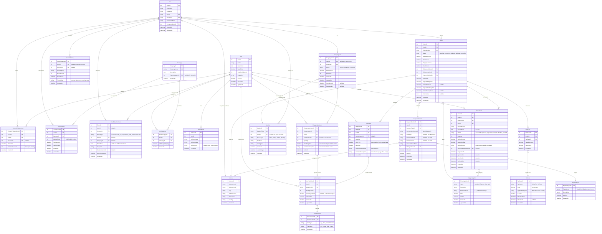

# Fully Relational ERD

```mermaid
erDiagram
    User ||--o{ Order : "places"
    User ||--o{ ShoppingCart : "has"
    User ||--o{ RecentlyViewedItem : "views"
    User ||--o{ UserInterest : "interested in"
    User ||--o{ SearchHistory : "searches"
    User ||--o{ UserBehaviorEvent : "generates"
    User }o--|| Address : "has primary address"

    Item ||--o{ ItemCategory : "belongs to"
    Item ||--o{ ItemAttribute : "has"
    Item ||--o{ ItemVariation : "has variants"
    Item ||--o{ ShoppingCartItem : "added to cart"
    Item ||--o{ OrderItem : "ordered"
    Item ||--o{ RecentlyViewedItem : "viewed"
    Item ||--o{ ReturnItem : "returned"
    Item ||--o{ UserBehaviorEvent : "interacted with"
    
    Category ||--o{ ItemCategory : "contains"
    Category ||--o{ UserInterest : "user interests"
    
    ItemVariation ||--|| VariationTrait : "has trait"
    
    ShoppingCart ||--o{ ShoppingCartItem : "contains"
    ShoppingCart }o--|| Session : "associated with"
    
    ShoppingCartItem ||--o| ItemVariation : "specific variant"
    
    Order ||--o{ OrderItem : "contains"
    Order }o--|| ShippingOption : "uses"
    Order }o--|| PaymentMethod : "paid with"
    Order }o--|| Address : "ships to"
    Order ||--o{ OrderTax : "has taxes"
    Order ||--o{ ReturnItem : "has returns"
    
    OrderItem ||--o| ItemVariation : "specific variant"
    
    OrderTax }o--|| TaxRate : "applies rate"
    
    PaymentMethod }o--|| PaymentType : "is type"
    PaymentMethod }o--|| Address : "billing address"
    
    ReturnItem }o--|| ShippingOption : "return shipping"
    
    Session }o--|| User : "belongs to"

    User {
        int UserID PK
        string FirstName
        string LastName
        string Email UK
        string Username UK
        string PasswordHash
        int PrimaryAddressID FK
        datetime CreatedAt
        datetime UpdatedAt
    }
    
    Address {
        int AddressID PK
        string AddressLine1
        string AddressLine2
        string City
        string StateProvince
        string PostalCode
        string Country
        datetime CreatedAt
    }
    
    Item {
        int ItemID PK
        string Name
        text Description
        decimal BasePrice
        int TotalStockQuantity
        string ImageURL
        boolean IsActive
        datetime CreatedAt
        datetime UpdatedAt
    }
    
    Category {
        int CategoryID PK
        string CategoryName UK
        text Description
        int ParentCategoryID FK "nullable for hierarchy"
        datetime CreatedAt
    }
    
    ItemCategory {
        int ItemCategoryID PK
        int ItemID FK
        int CategoryID FK
        boolean IsPrimaryCategory
        datetime CreatedAt
    }
    
    ItemAttribute {
        int AttributeID PK
        int ItemID FK
        string AttributeName
        string AttributeValue
        string AttributeUnit "nullable, e.g., hours, grams"
        datetime CreatedAt
    }
    
    ItemVariation {
        int ItemVariationID PK
        int ItemID FK
        string VariationSKU UK
        int StockQuantity
        decimal PriceAdjustment "nullable, +/- from base price"
        boolean IsAvailable
        datetime CreatedAt
        datetime UpdatedAt
    }
    
    VariationTrait {
        int VariationTraitID PK
        int ItemVariationID FK
        string TraitType "e.g., Size, Color, Material"
        string TraitValue "e.g., Large, Blue, Cotton"
        datetime CreatedAt
    }
    
    Session {
        int SessionID PK
        string SessionToken UK
        int UserID FK "nullable for guest sessions"
        string DeviceType "tablet, laptop, mobile, desktop"
        string IPAddress
        string UserAgent
        datetime CreatedAt
        datetime LastActivityAt
        datetime ExpiresAt
    }
    
    ShoppingCart {
        int ShoppingCartID PK
        int UserID FK "nullable for guest carts"
        int SessionID FK
        string Status "active, abandoned, converted"
        decimal TotalAmount
        int TotalItems
        datetime CreatedAt
        datetime UpdatedAt
        datetime AbandonedAt "nullable"
        datetime ConvertedAt "nullable"
    }
    
    ShoppingCartItem {
        int ShoppingCartItemID PK
        int ShoppingCartID FK
        int ItemID FK
        int ItemVariationID FK "nullable if no variation"
        int Quantity
        decimal PriceSnapshot "denormalized: price at time added"
        string ItemNameSnapshot "denormalized: item name"
        datetime AddedAt
        datetime UpdatedAt
    }
    
    Order {
        int OrderID PK
        int UserID FK
        string OrderNumber UK
        string Status "pending, processing, shipped, delivered, cancelled"
        decimal SubtotalAmount
        decimal TaxAmount
        decimal ShippingAmount
        decimal TotalAmount
        int ShippingAddressID FK
        int ShippingOptionID FK
        int PaymentMethodID FK
        datetime OrderDate
        datetime ExpectedShipDate
        datetime ActualShipDate "nullable"
        datetime ExpectedDeliveryDate
        datetime ActualDeliveryDate "nullable"
        text OrderNotes "nullable"
        datetime CreatedAt
        datetime UpdatedAt
    }
    
    OrderItem {
        int OrderItemID PK
        int OrderID FK
        int ItemID FK
        int ItemVariationID FK "nullable"
        int Quantity
        decimal UnitPrice "denormalized: price at purchase"
        decimal LineTotal
        string ItemNameSnapshot "denormalized"
        string VariationDescription "denormalized, e.g., Blue - Large"
        datetime CreatedAt
    }
    
    ShippingOption {
        int ShippingOptionID PK
        string Name "Standard, Express, Overnight"
        string Description
        string EstimatedDays "e.g., 3-5 business days"
        decimal Rate
        boolean IsActive
        datetime CreatedAt
        datetime UpdatedAt
    }
    
    TaxRate {
        int TaxRateID PK
        string TaxName "Sales Tax, VAT, etc."
        decimal Rate "percentage"
        string ApplicableRegion "State, Province, Country"
        boolean IsActive
        datetime EffectiveFrom
        datetime EffectiveTo "nullable"
        datetime CreatedAt
    }
    
    OrderTax {
        int OrderTaxID PK
        int OrderID FK
        int TaxRateID FK
        decimal TaxableAmount
        decimal TaxAmount
        datetime CreatedAt
    }
    
    PaymentType {
        int PaymentTypeID PK
        string TypeName "CreditCard, BankAccount, PayPal"
        string Description
        boolean IsActive
        datetime CreatedAt
    }
    
    PaymentMethod {
        int PaymentMethodID PK
        int UserID FK
        int PaymentTypeID FK
        string AccountNumberLast4 "last 4 digits only"
        string CardType "nullable, Visa/MC/Amex"
        string ExpirationMonth "nullable, for cards"
        string ExpirationYear "nullable, for cards"
        string AccountHolderName
        int BillingAddressID FK
        boolean IsDefault
        boolean IsActive
        datetime CreatedAt
        datetime UpdatedAt
    }
    
    ReturnItem {
        int ReturnID PK
        int OrderID FK
        int OrderItemID FK
        int ItemID FK
        string ReturnReason
        text ReturnNotes "nullable"
        string Status "requested, approved, in_transit, received, refunded, rejected"
        int Quantity
        decimal RefundAmount
        decimal RestockingFee
        string RefundStatus "pending, processed, completed"
        int ReturnShippingOptionID FK "nullable"
        datetime RequestedAt
        datetime ApprovedAt "nullable"
        datetime ReceivedAt "nullable"
        datetime RefundedAt "nullable"
        datetime CreatedAt
        datetime UpdatedAt
    }
    
    RecentlyViewedItem {
        int RecentlyViewedItemID PK
        int UserID FK
        int ItemID FK
        int SessionID FK "nullable"
        datetime ViewedAt
        int DurationSeconds "time spent viewing"
        datetime CreatedAt
    }
    
    UserInterest {
        int UserInterestID PK
        int UserID FK
        int CategoryID FK
        int InterestScore "1-10 implicit scoring"
        datetime FirstInterestAt
        datetime LastInterestAt
        datetime CreatedAt
        datetime UpdatedAt
    }
    
    SearchHistory {
        int SearchHistoryID PK
        int UserID FK "nullable for guest searches"
        int SessionID FK "nullable"
        string SearchQuery
        int ResultCount
        datetime SearchedAt
        string TimeOfDay "morning, afternoon, evening, night"
        datetime CreatedAt
    }
    
    UserBehaviorEvent {
        int EventID PK
        int UserID FK "nullable"
        int SessionID FK
        string EventType "view, click, add_to_cart, remove_from_cart, search, filter"
        int ItemID FK "nullable"
        int CategoryID FK "nullable"
        text EventData "JSON for additional context"
        string PageURL
        int DurationSeconds "nullable"
        datetime EventTimestamp
        datetime CreatedAt
    }

```
