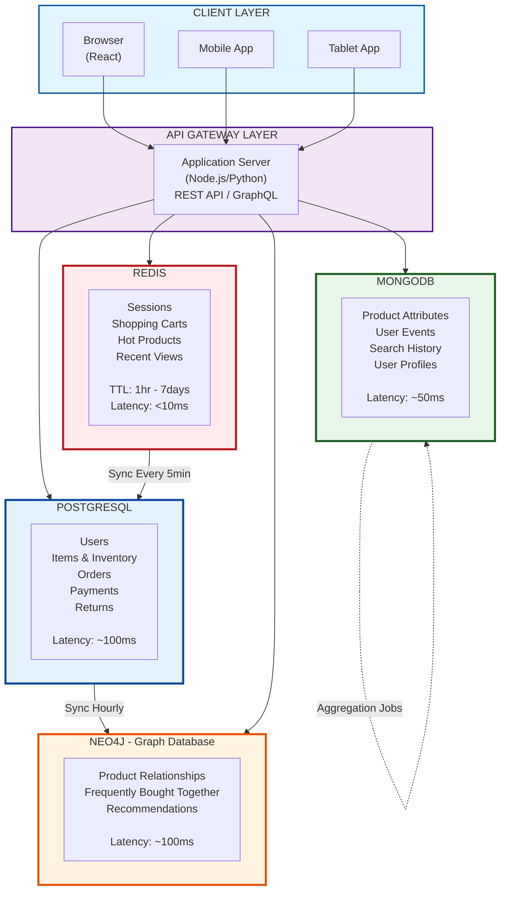

# Non Relational Diagram

```mermaid
graph TB
    subgraph Client["CLIENT LAYER"]
        Browser["Browser<br/>(React)"]
        Mobile["Mobile App"]
        Tablet["Tablet App"]
    end
    
    subgraph API["API GATEWAY LAYER"]
        AppServer["Application Server<br/>(Node.js/Python)<br/>REST API / GraphQL"]
    end
    
    subgraph Redis["REDIS"]
        RedisData["Sessions<br/>Shopping Carts<br/>Hot Products<br/>Recent Views<br/><br/>TTL: 1hr - 7days<br/>Latency: <10ms"]
    end
    
    subgraph MongoDB["MONGODB"]
        MongoData["Product Attributes<br/>User Events<br/>Search History<br/>User Profiles<br/><br/>Latency: ~50ms"]
    end
    
    subgraph PostgreSQL["POSTGRESQL"]
        PGData["Users<br/>Items & Inventory<br/>Orders<br/>Payments<br/>Returns<br/><br/>Latency: ~100ms"]
    end
    
    subgraph Neo4j["NEO4J - Graph Database"]
        NeoData["Product Relationships<br/>Frequently Bought Together<br/>Recommendations<br/><br/>Latency: ~100ms"]
    end
    
    Browser --> AppServer
    Mobile --> AppServer
    Tablet --> AppServer
    
    AppServer --> Redis
    AppServer --> MongoDB
    AppServer --> PostgreSQL
    
    Redis -->|"Sync Every 5min"| PostgreSQL
    PostgreSQL -->|"Sync Hourly"| Neo4j
    MongoDB -.->|"Aggregation Jobs"| MongoDB
    
    AppServer --> Neo4j
    
    style Client fill:#e1f5ff,stroke:#01579b,stroke-width:2px
    style API fill:#f3e5f5,stroke:#4a148c,stroke-width:2px
    style Redis fill:#ffebee,stroke:#b71c1c,stroke-width:3px
    style MongoDB fill:#e8f5e9,stroke:#1b5e20,stroke-width:3px
    style PostgreSQL fill:#e3f2fd,stroke:#0d47a1,stroke-width:3px
    style Neo4j fill:#fff3e0,stroke:#e65100,stroke-width:3px
```