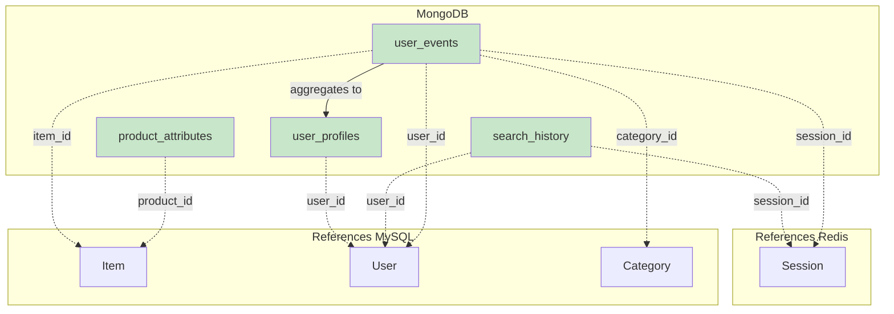

# Mongo DB Diagram



```plaintext
Collection: product_attributes
{
  _id: ObjectId,
  product_id: String,           // Item.ItemID
  category: String,
  attributes: {                 // Flexible by category
    // Electronics: battery_life, connectivity, weight
    // Fashion: material, sizes, colors
    // Home: dimensions, care_instructions
  },
  stock_by_variant: {
    "variant_key": Number       // "blue-large": 5
  },
  created_at: Date,
  updated_at: Date
}

// Indexes
product_id (unique)
category
updated_at


Collection: user_events
{
  _id: ObjectId,
  user_id: String,              // User.UserID (nullable)
  session_id: String,           // Redis Session
  event_type: String,           // "view", "click", "add_to_cart", "search"
  event_data: {
    product_id: String,         // Item.ItemID (nullable)
    category_id: String,        // Category.CategoryID (nullable)
    duration_seconds: Number,
    // ... event-specific data
  },
  timestamp: Date,
  device_type: String,
  created_at: Date
}

// Indexes
user_id + timestamp
session_id + timestamp
event_type + timestamp
product_id + timestamp
created_at (TTL: 2 years)

Collection: search_history
{
  _id: ObjectId,
  user_id: String,              // User.UserID (nullable)
  session_id: String,           // Redis Session (nullable)
  search_query: String,
  filters_applied: Object,
  result_count: Number,
  results_clicked: [String],    // Array of product_ids
  searched_at: Date,
  time_of_day: String,          // "morning", "afternoon", "evening", "night"
  created_at: Date
}

// Indexes
user_id + searched_at
search_query (text index)
time_of_day
created_at (TTL: 1 year)

Collection: user_profiles
{
  _id: ObjectId,
  user_id: String,              // User.UserID (unique)
  category_interests: {
    "category_name": {
      score: Number,            // 0-100
      view_count: Number,
      purchase_count: Number
    }
  },
  browsing_patterns: {
    peak_times: [String],
    devices_used: [String],
    avg_session_duration: Number
  },
  purchase_patterns: {
    total_orders: Number,
    avg_order_value: Number,
    last_purchase_date: Date
  },
  updated_at: Date
}

// Indexes
user_id (unique)
updated_at
```
