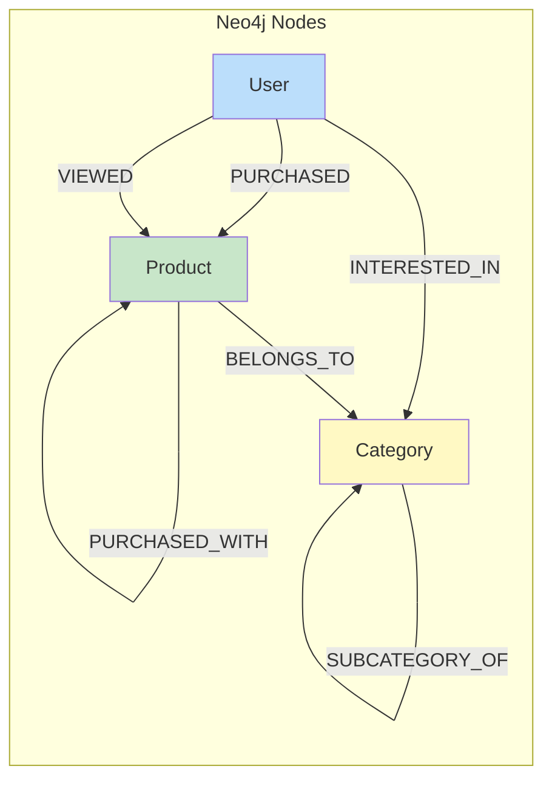

# Neo4j Diagram



```cypher
Node: User
(:User {
  user_id: String,             // MySQL User.UserID
  name: String,
  total_orders: Number,
  synced_at: DateTime
})

// Constraint: user_id (unique)
Node: Product
(:Product {
  product_id: String,          // MySQL Item.ItemID
  name: String,
  category: String,
  price: Decimal,
  total_purchases: Number,
  synced_at: DateTime
})

// Constraint: product_id (unique)
Node: Category
(:Category {
  category_id: String,         // MySQL Category.CategoryID
  name: String,
  synced_at: DateTime
})

// Constraint: category_id (unique)
Relationship: PURCHASED
(:User)-[:PURCHASED {
  order_id: String,
  purchased_at: DateTime,
  quantity: Number,
  total_price: Decimal
}]->(:Product)
Relationship: PURCHASED_WITH
(:Product)-[:PURCHASED_WITH {
  count: Number,               // Times bought together
  confidence: Float,           // 0-1 score
  updated_at: DateTime
}]-(:Product)
Relationship: VIEWED
(:User)-[:VIEWED {
  session_id: String,
  viewed_at: DateTime,
  duration_seconds: Number
}]->(:Product)
Relationship: INTERESTED_IN
(:User)-[:INTERESTED_IN {
  interest_score: Number,      // 0-100
  view_count: Number,
  purchase_count: Number
}]->(:Category)
Relationship: BELONGS_TO
(:Product)-[:BELONGS_TO]->(:Category)
```
