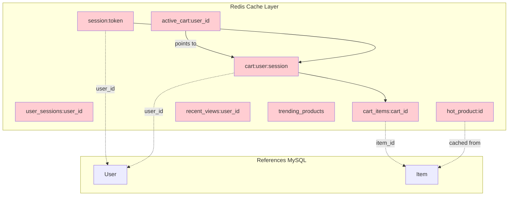

# Redis Diagram



```plaintext
Pattern: session:{token}
Type: Hash
TTL: 24 hours

Fields:
  session_id: String
  user_id: String              //  User.UserID (nullable)
  device_type: String
  created_at: Timestamp
  last_activity_at: Timestamp

Pattern: cart:{user_id}:{session_id}
Type: Hash
TTL: 7 days

Fields:
  cart_id: String
  user_id: String              //  User.UserID (nullable)
  session_id: String
  status: String               // "active", "abandoned", "converted"
  total_items: Number
  total_amount: Decimal
  updated_at: Timestamp

Pattern: cart_items:{cart_id}
Type: List (JSON strings)
TTL: 7 days

Element:
{
  item_id: String,             //  Item.ItemID
  variation_id: String,        //  ItemVariation.ItemVariationID
  quantity: Number,
  price: Decimal,
  name: String
}

Pattern: hot_product:{product_id}
Type: Hash
TTL: 5 minutes

Fields:
  product_id: String
  name: String
  price: Decimal
  stock: Number
  image_url: String
  is_available: Boolean
  
Pattern: recent_views:{user_id}
Type: Sorted Set
TTL: 6 months

Member: "product_id:duration"
Score: timestamp
Limit: Keep last 10
Pattern: trending_products
Type: Sorted Set
TTL: 1 hour

Member: product_id
Score: view_count (last hour)
```
