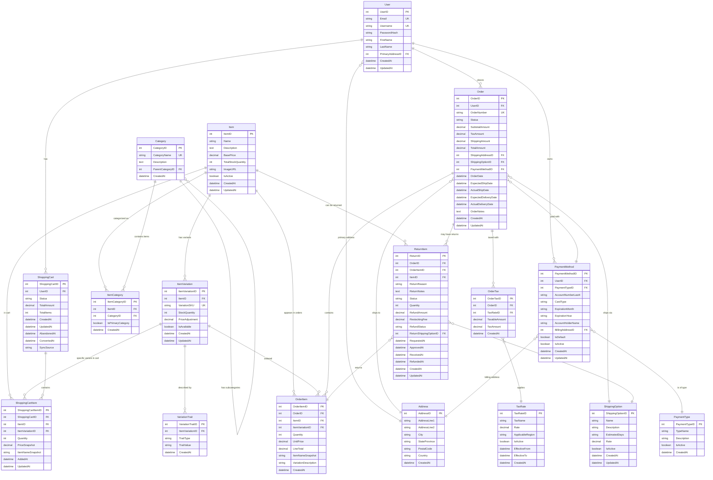

# Relational ERD

```mermaid
erDiagram
    %% ═══════════════════════════════════════════════════════════
    %% CORE ENTITIES
    %% ═══════════════════════════════════════════════════════════

    User ||--o{ Order : "places"
    User ||--o{ PaymentMethod : "owns"
    User ||--o{ ShoppingCart : "has"
    User }o--|| Address : "primary address"

    %% ═══════════════════════════════════════════════════════════
    %% PRODUCT CATALOG
    %% ═══════════════════════════════════════════════════════════

    Item ||--o{ ItemCategory : "categorized as"
    Item ||--o{ ItemVariation : "has variants"
    Item ||--o{ OrderItem : "appears in orders"
    Item ||--o{ ShoppingCartItem : "in cart"
    Item ||--o{ ReturnItem : "can be returned"

    Category ||--o{ ItemCategory : "contains items"
    Category ||--o{ Category : "has subcategories"

    ItemVariation ||--o{ VariationTrait : "described by"
    ItemVariation ||--o{ OrderItem : "ordered"
    ItemVariation ||--o{ ShoppingCartItem : "specific variant in cart"

    %% ═══════════════════════════════════════════════════════════
    %% SHOPPING CART (MySQL Backup)
    %% ═══════════════════════════════════════════════════════════

    ShoppingCart ||--o{ ShoppingCartItem : "contains"

    %% ═══════════════════════════════════════════════════════════
    %% ORDER PROCESSING
    %% ═══════════════════════════════════════════════════════════

    Order ||--o{ OrderItem : "contains"
    Order }o--|| ShippingOption : "ships via"
    Order }o--|| PaymentMethod : "paid with"
    Order }o--|| Address : "ships to"
    Order ||--o{ OrderTax : "taxed with"
    Order ||--o{ ReturnItem : "may have returns"

    OrderTax }o--|| TaxRate : "applies"

    %% ═══════════════════════════════════════════════════════════
    %% PAYMENT
    %% ═══════════════════════════════════════════════════════════

    PaymentMethod }o--|| PaymentType : "is of type"
    PaymentMethod }o--|| Address : "billing address"

    %% ═══════════════════════════════════════════════════════════
    %% RETURNS
    %% ═══════════════════════════════════════════════════════════

    ReturnItem }o--|| OrderItem : "returns"
    ReturnItem }o--|| ShippingOption : "return shipping"

    %% ═══════════════════════════════════════════════════════════
    %% ENTITY DEFINITIONS
    %% ═══════════════════════════════════════════════════════════

    User {
        int UserID PK
        string Email UK
        string Username UK
        string PasswordHash
        string FirstName
        string LastName
        int PrimaryAddressID FK
        datetime CreatedAt
        datetime UpdatedAt
    }

    Address {
        int AddressID PK
        string AddressLine1
        string AddressLine2
        string City
        string StateProvince
        string PostalCode
        string Country
        datetime CreatedAt
    }

    Item {
        int ItemID PK
        string Name
        text Description
        decimal BasePrice
        int TotalStockQuantity
        string ImageURL
        boolean IsActive
        datetime CreatedAt
        datetime UpdatedAt
    }

    Category {
        int CategoryID PK
        string CategoryName UK
        text Description
        int ParentCategoryID FK
        datetime CreatedAt
    }

    ItemCategory {
        int ItemCategoryID PK
        int ItemID FK
        int CategoryID FK
        boolean IsPrimaryCategory
        datetime CreatedAt
    }

    ItemVariation {
        int ItemVariationID PK
        int ItemID FK
        string VariationSKU UK
        int StockQuantity
        decimal PriceAdjustment
        boolean IsAvailable
        datetime CreatedAt
        datetime UpdatedAt
    }

    VariationTrait {
        int VariationTraitID PK
        int ItemVariationID FK
        string TraitType
        string TraitValue
        datetime CreatedAt
    }

    ShoppingCart {
        int ShoppingCartID PK
        int UserID FK
        string Status
        decimal TotalAmount
        int TotalItems
        datetime CreatedAt
        datetime UpdatedAt
        datetime AbandonedAt
        datetime ConvertedAt
        string SyncSource
    }

    ShoppingCartItem {
        int ShoppingCartItemID PK
        int ShoppingCartID FK
        int ItemID FK
        int ItemVariationID FK
        int Quantity
        decimal PriceSnapshot
        string ItemNameSnapshot
        datetime AddedAt
        datetime UpdatedAt
    }

    Order {
        int OrderID PK
        int UserID FK
        string OrderNumber UK
        string Status
        decimal SubtotalAmount
        decimal TaxAmount
        decimal ShippingAmount
        decimal TotalAmount
        int ShippingAddressID FK
        int ShippingOptionID FK
        int PaymentMethodID FK
        datetime OrderDate
        datetime ExpectedShipDate
        datetime ActualShipDate
        datetime ExpectedDeliveryDate
        datetime ActualDeliveryDate
        text OrderNotes
        datetime CreatedAt
        datetime UpdatedAt
    }

    OrderItem {
        int OrderItemID PK
        int OrderID FK
        int ItemID FK
        int ItemVariationID FK
        int Quantity
        decimal UnitPrice
        decimal LineTotal
        string ItemNameSnapshot
        string VariationDescription
        datetime CreatedAt
    }

    ShippingOption {
        int ShippingOptionID PK
        string Name
        string Description
        string EstimatedDays
        decimal Rate
        boolean IsActive
        datetime CreatedAt
        datetime UpdatedAt
    }

    TaxRate {
        int TaxRateID PK
        string TaxName
        decimal Rate
        string ApplicableRegion
        boolean IsActive
        datetime EffectiveFrom
        datetime EffectiveTo
        datetime CreatedAt
    }

    OrderTax {
        int OrderTaxID PK
        int OrderID FK
        int TaxRateID FK
        decimal TaxableAmount
        decimal TaxAmount
        datetime CreatedAt
    }

    PaymentType {
        int PaymentTypeID PK
        string TypeName
        string Description
        boolean IsActive
        datetime CreatedAt
    }

    PaymentMethod {
        int PaymentMethodID PK
        int UserID FK
        int PaymentTypeID FK
        string AccountNumberLast4
        string CardType
        string ExpirationMonth
        string ExpirationYear
        string AccountHolderName
        int BillingAddressID FK
        boolean IsDefault
        boolean IsActive
        datetime CreatedAt
        datetime UpdatedAt
    }

    ReturnItem {
        int ReturnID PK
        int OrderID FK
        int OrderItemID FK
        int ItemID FK
        string ReturnReason
        text ReturnNotes
        string Status
        int Quantity
        decimal RefundAmount
        decimal RestockingFee
        string RefundStatus
        int ReturnShippingOptionID FK
        datetime RequestedAt
        datetime ApprovedAt
        datetime ReceivedAt
        datetime RefundedAt
        datetime CreatedAt
        datetime UpdatedAt
    }
```
