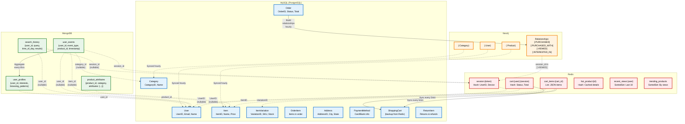

# Cross DB

```mermaid
graph TB
    subgraph MYSQL["MySQL (PostgreSQL)"]
        direction TB
        M_User["User<br/>UserID, Email, Name"]
        M_Item["Item<br/>ItemID, Name, Price"]
        M_Category["Category<br/>CategoryID, Name"]
        M_ItemVariation["ItemVariation<br/>VariationID, SKU, Stock"]
        M_Order["Order<br/>OrderID, Status, Total"]
        M_OrderItem["OrderItem<br/>Items in order"]
        M_Address["Address<br/>AddressID, City, State"]
        M_PaymentMethod["PaymentMethod<br/>Card/Bank info"]
        M_ShoppingCart["ShoppingCart<br/>(backup from Redis)"]
        M_ReturnItem["ReturnItem<br/>Returns & refunds"]
    end

    subgraph REDIS["Redis"]
        direction TB
        R_Session["session:{token}<br/>Hash: UserID, Device"]
        R_Cart["cart:{user}:{session}<br/>Hash: Status, Total"]
        R_CartItems["cart_items:{cart_id}<br/>List: JSON items"]
        R_HotProducts["hot_product:{id}<br/>Hash: Cached details"]
        R_RecentViews["recent_views:{user}<br/>SortedSet: Last 10"]
        R_Trending["trending_products<br/>SortedSet: By views"]
    end

    subgraph MONGO["MongoDB"]
        direction TB
        MG_ProductAttrs["product_attributes<br/>{product_id, category,<br/>attributes: {...}}"]
        MG_Events["user_events<br/>{user_id, event_type,<br/>product_id, timestamp}"]
        MG_Search["search_history<br/>{user_id, query,<br/>time_of_day, results}"]
        MG_Profile["user_profiles<br/>{user_id, interests,<br/>browsing_patterns}"]
    end

    subgraph NEO4J["Neo4j"]
        direction TB
        N_User["(:User)"]
        N_Product["(:Product)"]
        N_Category["(:Category)"]
        N_Relationships["Relationships:<br/>[:PURCHASED]<br/>[:PURCHASED_WITH]<br/>[:VIEWED]<br/>[:INTERESTED_IN]"]
    end

    %% ═══════════════════════════════════════════════════════════
    %% Redis -> MySQL (Application References)
    %% ═══════════════════════════════════════════════════════════

    R_Session -.->|"UserID<br/>(nullable)"| M_User
    R_Cart -.->|"UserID<br/>(nullable)"| M_User
    R_CartItems -.->|"ItemID"| M_Item
    R_CartItems -.->|"VariationID"| M_ItemVariation

    %% ═══════════════════════════════════════════════════════════
    %% Redis -> MySQL (Sync Jobs - Data Flow)
    %% ═══════════════════════════════════════════════════════════

    R_Cart -->|"Sync every 5min"| M_ShoppingCart
    R_CartItems -->|"Sync every 5min"| M_ShoppingCart

    %% ═══════════════════════════════════════════════════════════
    %% MongoDB -> MySQL (Application References)
    %% ═══════════════════════════════════════════════════════════

    MG_ProductAttrs -.->|"product_id"| M_Item
    MG_Events -.->|"user_id<br/>(nullable)"| M_User
    MG_Events -.->|"item_id<br/>(nullable)"| M_Item
    MG_Events -.->|"category_id<br/>(nullable)"| M_Category
    MG_Search -.->|"user_id<br/>(nullable)"| M_User
    MG_Profile -.->|"user_id"| M_User

    %% ═══════════════════════════════════════════════════════════
    %% MongoDB -> Redis (Application References)
    %% ═══════════════════════════════════════════════════════════

    MG_Events -.->|"session_id"| R_Session
    MG_Search -.->|"session_id<br/>(nullable)"| R_Session

    %% ═══════════════════════════════════════════════════════════
    %% MongoDB -> MongoDB (Aggregation Jobs - Data Flow)
    %% ═══════════════════════════════════════════════════════════

    MG_Events -->|"Aggregate<br/>every 6hrs"| MG_Profile

    %% ═══════════════════════════════════════════════════════════
    %% Neo4j -> MySQL (Sync Jobs - Data Flow)
    %% ═══════════════════════════════════════════════════════════

    N_User -.->|"Synced hourly"| M_User
    N_Product -.->|"Synced hourly"| M_Item
    N_Category -.->|"Synced hourly"| M_Category
    M_Order -->|"Build<br/>relationships<br/>hourly"| N_Relationships

    %% ═══════════════════════════════════════════════════════════
    %% Neo4j -> Redis (Application References)
    %% ═══════════════════════════════════════════════════════════

    N_Relationships -.->|"session_id in<br/>[:VIEWED]"| R_Session

    %% ═══════════════════════════════════════════════════════════
    %% Styling
    %% ═══════════════════════════════════════════════════════════

    classDef mysqlStyle fill:#e3f2fd,stroke:#1976d2,stroke-width:3px,color:#000
    classDef redisStyle fill:#ffebee,stroke:#d32f2f,stroke-width:3px,color:#000
    classDef mongoStyle fill:#e8f5e9,stroke:#388e3c,stroke-width:3px,color:#000
    classDef neoStyle fill:#fff3e0,stroke:#f57c00,stroke-width:3px,color:#000

    class M_User,M_Item,M_Category,M_ItemVariation,M_Order,M_OrderItem,M_Address,M_PaymentMethod,M_ShoppingCart,M_ReturnItem mysqlStyle
    class R_Session,R_Cart,R_CartItems,R_HotProducts,R_RecentViews,R_Trending redisStyle
    class MG_ProductAttrs,MG_Events,MG_Search,MG_Profile mongoStyle
    class N_User,N_Product,N_Category,N_Relationships neoStyle
```
